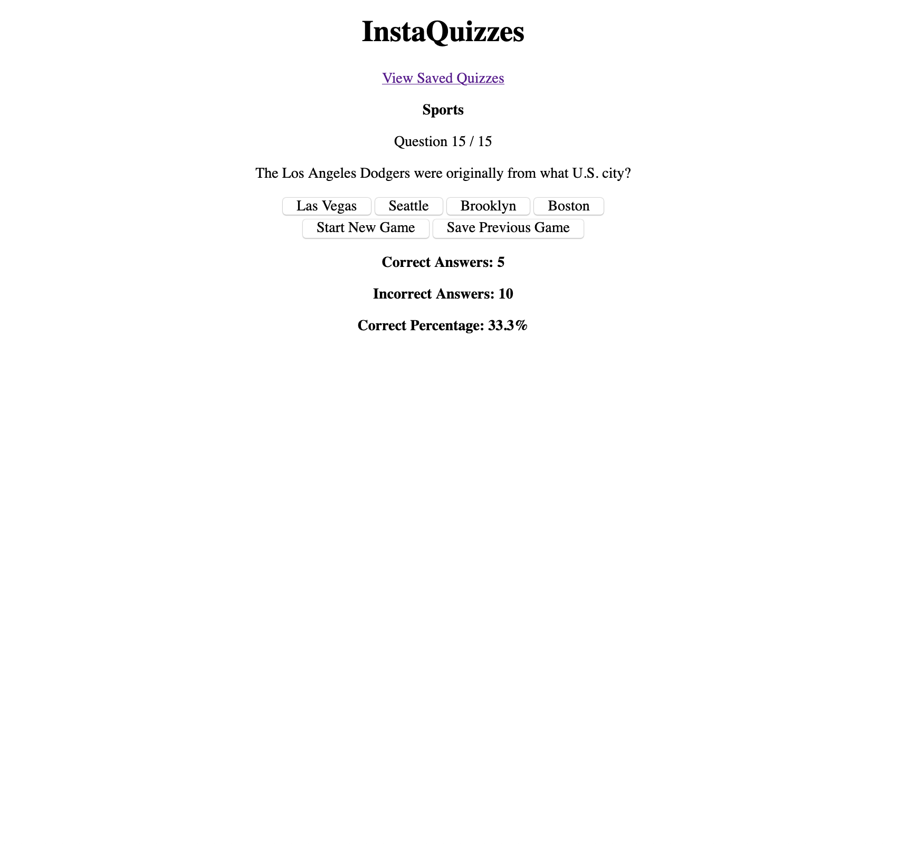
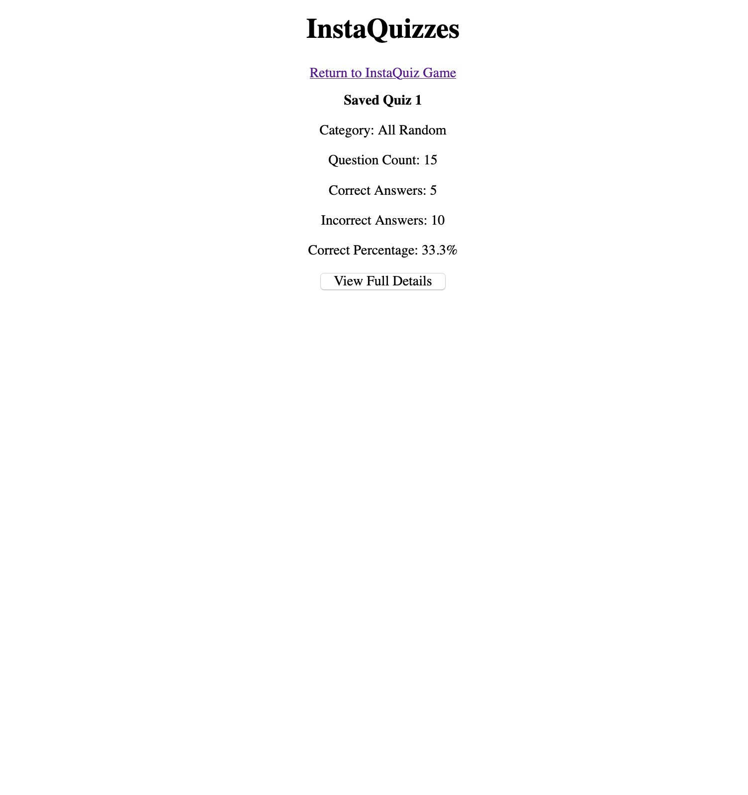

# InstaQuizzes!

## Abstract

InstaQuizzes is an app that will allow users to play through randomly generated Quiz Games! This app is intended for any user that would like to play quizzes to increase general knowledge and have fun with family. Clicking on the 'Start a New InstaQuiz' button will generate a randomly generated Quiz from an API Fetch to `https://opentdb.com/`. After answering the default of 15 questions, a user will be able to see their stats for the quiz; featuring correct answers, incorrect answers and correct answers percentage.

A user is also able to replay a new quiz game and/or save the quiz them they just played for review later. After saving a quiz, a user can see all list of quizzes they have saved and go even further to pull up all of the details of the quiz. Including questions asked, available answers and answer the user logged.

### App in Action

**Quiz End**


**Saved Quizzes**


## Setup & Installation

To view and use the application, clone down [this repository](https://github.com/npdarrington/) and install with npm.

```
git@github.com:npdarrington/instaquizzes.git
npm install
npm start --> localhost:3000 by default
```

To view the test suite for InstaQuizzes:

```
Inside of the InstaQuizzes directory--> npm test
```

## Skills

- Stateful and Pure components
- React Router DOM
- Test Driven Development - Jest, React Router Library, User Event, Async Testing, Unit Testing, Integration Testing
- Working solo on a project from initial conception to final commit.
- Code base efficiency by following SRP and DRY principles and using newer technologies.
- Conditionally rendering and artfully displaying specific feedback messages for user for a smooth UI/UX experience.

## Technologies Used

- Create React App
- React Router
- JSX
- HTML
- CSS/SASS
- Jest
- NPM
- GitHub/Git
- Eslint
- React Testing Library
- Restful API
- User-Event
- Typescript
- React Hooks

## Wins & Challenges

### Challenges

- Structuring the code, using the newer technologies of Typescript and React Hooks while on a tight time crunch.
- Information feedback for the user that allows them to see exactly what is happening with every action they perform.
- Deciding the most efficient places for React Hooks state to live.
- A large learning curve with React Testing Library as well as unit, integration, mock fetch testing, navigation testing and interactive testing.

### Wins

- Tackling complicated logic involving a brand new tech stack and setting up new technologies.
- Having a full set of tests through TDD that tests for unit component testing, integration between multiple component testing and interactive testing to simulate user actions and feedback while using Typescript to its full potential.
- Completing the full MVP that was the initial goal within a 2 day time span.

### Learning Lessons

- After a family emergency, I should have adjusted the MVP to accomodate for the change in timing schedule. Originally 4 days was changed into finishing the project within 2 days. Such as changing back to vanilla React instead of continuing with Typescript and React Hooks.
- Always give yourself a chance, no matter how slim the chances may seem to finish something. This has increased my mental and emotional intelligence to a much higher level.

### Continuing Goals

- Allow a user to adjust some settings, such as question count, a specific category, and difficulty when starting a new game.
- Styling to make it more pleasing to a user.
- Create another component that contains the entire Game Playing aspect of the app.

## Contributors

- [Nathan Darrington](https://github.com/npdarrington)

## Additional Links

- [Project Board](https://github.com/npdarrington/instaquizzes/projects/1)
